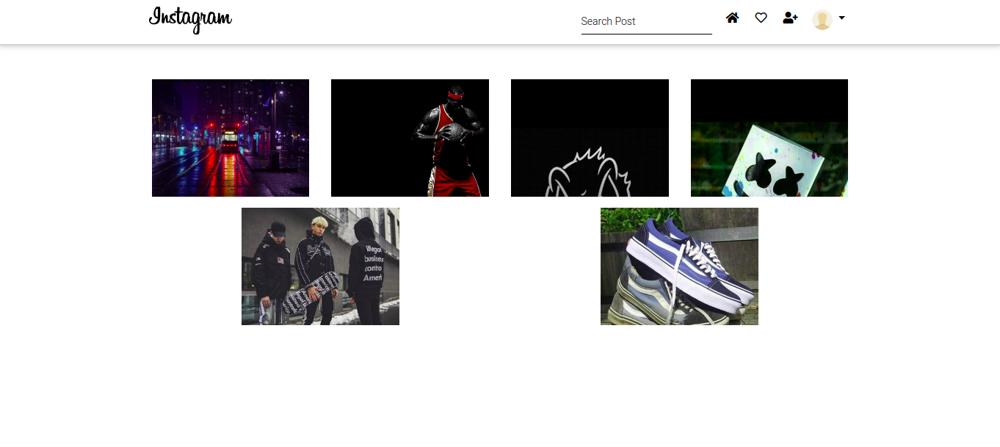
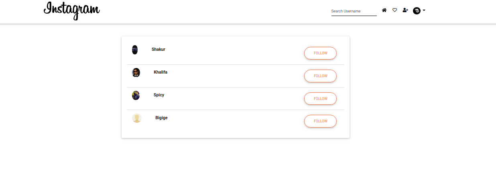
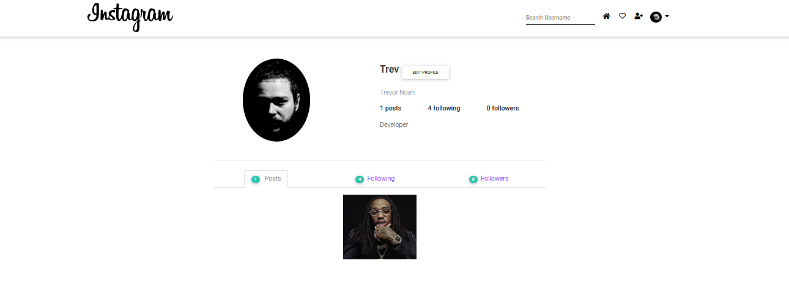

# INSTA---GRAM
### 16.10.2020
#### A Django Instagram clone
## Author
[Dennis Kamunya](https://github.com/D-Kamunya)

## Versioning
shutter-up V1.0
## Description
Instagram clone is a clone of the instagram site where a user can register after registraring,view following posts.

## Live link
Live application can be found at  https://insta---gram.herokuapp.com/
## User Story
User can sign in to the application to start using.
User can upload my pictures to the application.
User can view posts of following users
User can like a picture and leave a comment on it.

## Behavior Driven Development

| Input                    | Behaviour                       | Output                                       |
| -------------------------| ------------------------------  | -------------------------------------------- |
| User registers for an account by filling form            | Page redirects user to home page after success               | Home page displays posts of folllowing users               |
| User logs in             | User is taken to the home page | Redirect you to the homepage where the user is greeted with a feed of most recent photos posted             |
| User clicks upload button and fills the form         | The page reloads    | User's new post is displayed on the feed                     | 
| User clicks on the like button | The page reloads | Like count of the post is increased by one value   |
| User posts a comment by filling the form       | The page reloads    | The new comment is added onto the post's comment section , showing th comment and its author, and comment count is updated  in the feed            |
| User clicks follow button     | User starts following that user   | User is added to following|
| User clicks unfollow button     | User starts unfollowing that user   | User is removed from following|

## Technologies Used
* Python 3.8
* Django 1.11.23
* PostgreSQL
* HTML  
* CSS
* JS
* MDB 4
    * Bootstrap 4
    * Font Awesome 
    * jQuery 3
* Google Font API

## Requirements
* This program requires python3.+ (and pip) installed, a guide on how to install python on various platforms can be found [here](https://www.python.org/)

## Installation and Set-up
Here is a run through of how to set up the application:
* **Step 1** : Clone this repository using **`https://github.com/D-Kamunyainstagram-clone.git`**, or downloading a ZIP file of the code.
* **Step 2** : The repository, if downloaded as a .zip file will need to be extracted to your preferred location and opened
* **Step 3** : Go to the project root directory and  create a virtual environment. Run the following commands respectively:
    * **`python3.8 -m venv --without-pip virtual`**
    * **`source virtual/bin/activate`**
        * Note that you can exit the virtual environment by running the command **`deactivate`**
* **Step 4** :  Download the latest version of pip in virtual our environment.   
    * **`curl https://bootstrap.pypa.io/get-pip.py | python`**  

* **Step 5** : Download the all dependencies in the requirements.txt using **`pip install -r requirements.txt`**
* **Step 6** : Create the Database
    * - psql
    * - CREATE DATABASE shutter_up;
* **Step 7** : .env file
    * Create .env file and paste paste the following filling where appropriate:

    * - SECRET_KEY = '<Secret_key>'
    * - DBNAME = '<DB_NAME>'
    * - USER = '<USER_>'
    * - PASSWORD = '<Password>'
    * - DEBUG = True
* **Step 8** : Run initial Migration
    * python3 manage.py makemigrations gallery
    * python3 manage.py migrate
* **Step 10** : Create admin credentials
    * python3 manage.py createsuperuser
  
* **Step 11** : Run application
    * python3 manage.py runserver
    * Open your preferred browser and view the app by opening the link **http://127.0.0.1:8000/**.

## Known Bugs
* No known bugs
Be sure to report more bugs by contacting me.

## Contribution
Pull requests are welcome. For major changes, please open an issue first to discuss what you would like to change.
## Support and contact details
If you run into any problems feel free to contact me @dennismuriithik@gmail.com

#### License

Permission is hereby granted, free of charge, to any person obtaining a copy of this software and associated documentation files (the "Software"), to deal in the Software without restriction, including without limitation the rights to use, copy, modify, merge, publish, distribute, sublicense, and/or sell copies of the Software, and to permit persons to whom the Software is furnished to do so, subject to the following conditions:

The above copyright notice and this permission notice shall be included in all copies or substantial portions of the Software.

THE SOFTWARE IS PROVIDED "AS IS", WITHOUT WARRANTY OF ANY KIND, EXPRESS OR IMPLIED, INCLUDING BUT NOT LIMITED TO THE WARRANTIES OF MERCHANTABILITY, FITNESS FOR A PARTICULAR PURPOSE AND NONINFRINGEMENT. IN NO EVENT SHALL THE AUTHORS OR COPYRIGHT HOLDERS BE LIABLE FOR ANY CLAIM, DAMAGES OR OTHER LIABILITY, WHETHER IN AN ACTION OF CONTRACT, TORT OR OTHERWISE, ARISING FROM, OUT OF OR IN CONNECTION WITH THE SOFTWARE OR THE USE OR OTHER DEALINGS IN THE SOFTWARE.

Copyright (c) 2020 Dennis Kamunya
